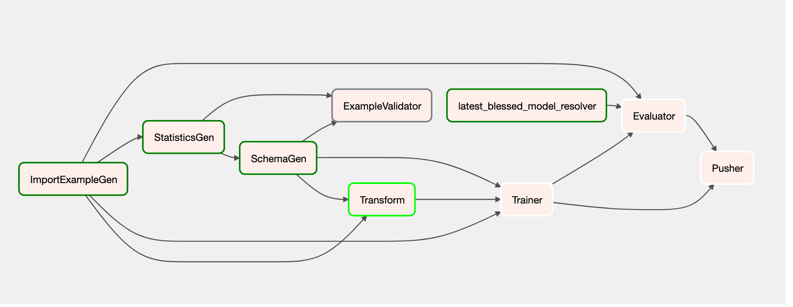

# Machine learning pipeline practice

TFX 컴포넌트로 데이터 수집, 통계 생성, 스키마 생성, 데이터 검증, 데이터 변환, 모델 훈련, 모델 평가,
모델 선택, 모델 평가, 배포까지 아우르는 파이프라인을 생성해보는 연습이다. 사용한 데이터셋은 Consumer Complaint
Database로서 [미국 소비자 금융 보호국](https://www.consumerfinance.gov/data-research/consumer-complaints/)에서 얻을 수 있다.

# 빠른 실행

- 주의: 현재 파이썬 패키지로 배포되는 TFX는 arm 아키텍쳐를 지원하지 않는다.

1. 대화형 파이프라인: 레포를 내려 받은 후 interactive_pipeline/model_analysis.ipynb를 순차대로 실행.
2. Orchestration by Airflow: airflow_pipeline.py를 스크립트 첫머리에 있는 안내 사항을 읽고 실행.
3. Orchestrain by Beam: beam_pipeline.py 이 스크립트는 Airflow와 달리 따로 설정할 것은 없다. 그냥 실행.

# 디렉토리 설명

- artifacts: `interactive_pipeline/` 내 노트북 파일 실행 후 아티팩트. 용량이 기가 단위인 관계로 업로드하지 않는다.
- data: 이번 연습에 사용했던 데이터. 용량 관계로 업로드하지 않는다.
- models: Pusher가 내보내고 Serving이 읽어들일 모델들의 모음. 이것도 용량이 커 업로드하지 않는다.
- pipeline_root: Airflow, Beam 실행 과정 중에 생기는 아티팩트.
- interactive_pipeline: 데이터 소비부터 모델 배포까지 전체적인 과정을 한번에 실행해볼 수 있는 대화형 파이프라인. 이후 설명할 `airflow_pipeline.py`
  와 `beam_pipeline.py` 그리고 이 파이프라인 모두 실제 작업은 모두 동일하다. 다만 오케스트레이터가 어떤 것인지와 세세한 설정 차이가 있을 뿐이다.
- airflow_pipeline.py: Airflow를 오케스트레이터로 사용한 파이프라인.
- beam_pipeline.py: Beam을 오케스트레이터로 사용한 파이프라인.
- trainer_module.py: Trainer 컴포넌트가 요구하는 `run_fn` 함수와 이 함수가 의존하는 코드.
- transform_module.py: Transformer 컴포넌트가 요구하는 `preprocessing_fn` 함수와 이 함수가 의존하는 코드.

# 더 진행해 볼만한 것들
- Kubeflow 오케스트레이션
- TorchX로 파이프라인 구축